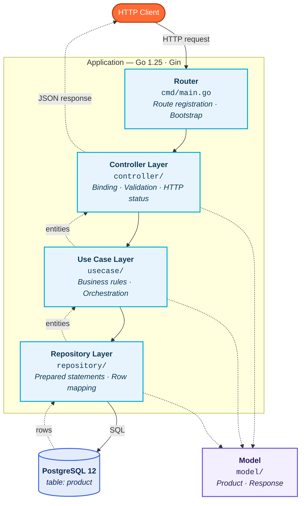
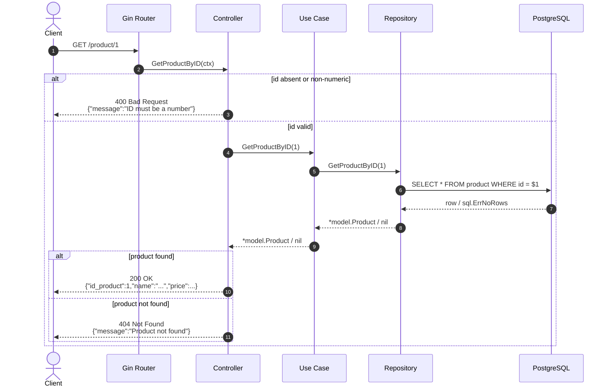
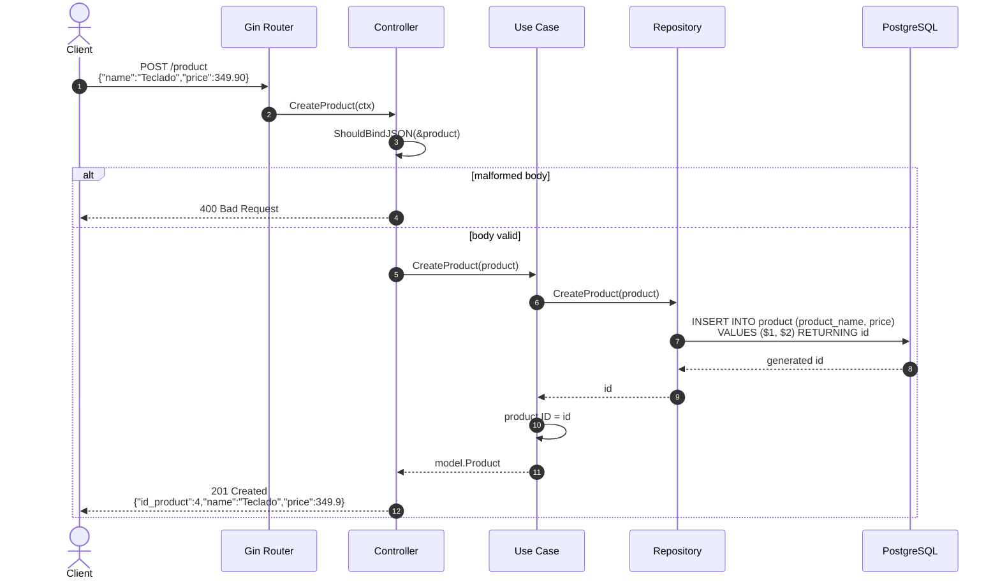
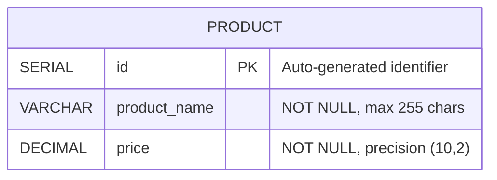
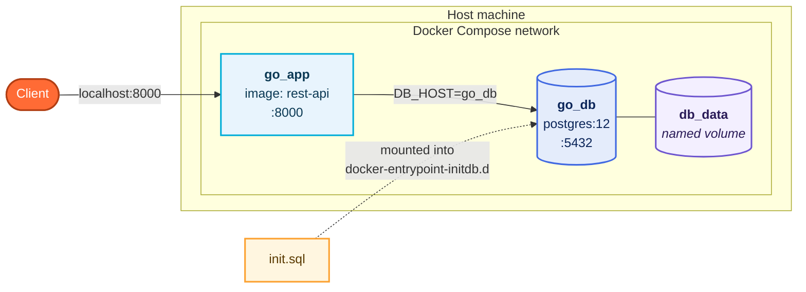
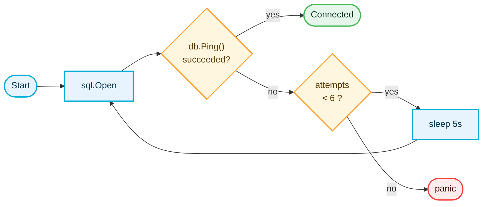

<div align="center">

# Product REST API

**A RESTful API written in Go for product management, built on a layered architecture and backed by PostgreSQL.**

<br>


<br><br>

[](https://go.dev)
[](https://gin-gonic.com)
[](https://www.postgresql.org)
[](https://www.docker.com)


</div>

---

## Table of Contents

| Section | Description |
| :--- | :--- |
| [Technology Stack](#technology-stack) | Languages, frameworks and infrastructure. |
| [Architecture](#architecture) | Layer responsibilities and dependency direction. |
| [Request Flow](#request-flow) | How a request traverses the application. |
| [Project Structure](#project-structure) | Directory and file organisation. |
| [Data Model](#data-model) | Domain entities and database schema. |
| [API Reference](#api-reference) | Endpoints, payloads and status codes. |
| [Getting Started](#getting-started) | Installation and execution. |
| [Configuration](#configuration) | Environment variables and defaults. |
| [Database Initialisation](#database-initialisation) | Schema bootstrap and seed data. |

---

## Technology Stack

<div align="center">

| | Component | Technology | Version |
| :---: | :--- | :--- | :--- |
|  | **Language** | Go | `1.25` |
|  | **HTTP Framework** | Gin (`gin-gonic/gin`) | `1.12.0` |
|  | **Database** | PostgreSQL | `12` |
|  | **Driver** | `lib/pq` | `1.12.3` |
|  | **Containerisation** | Docker / Docker Compose | — |

</div>

---

## Architecture

The project adopts a **layered architecture**, in which each layer holds a single, well-defined
responsibility and depends exclusively on the layer immediately beneath it. Dependencies are
supplied through constructor injection during application bootstrap in [cmd/main.go](cmd/main.go),
which keeps the layers decoupled and independently testable.



### Layer Responsibilities

| Layer | Package | Responsibility |
| :--- | :--- | :--- |
| **Controller** | `controller` | Receives HTTP requests, validates and parses input, and serialises responses. |
| **Use Case** | `usecase` | Hosts the business rules and orchestrates operations over the domain entities. |
| **Repository** | `repository` | Encapsulates all data access, executing SQL statements against PostgreSQL. |
| **Model** | `model` | Defines the domain entities and the standard response payload. |
| **Database** | `db` | Establishes and manages the PostgreSQL connection. |

---

## Request Flow

Every request traverses the layers in a strictly unidirectional manner, and the response
travels back along the same path in reverse order. Errors raised at any layer are propagated
upwards and translated by the controller into the appropriate HTTP status code.

### Retrieval — `GET /product/:id`



### Creation — `POST /product`



---

## Project Structure

```
restAPI/
│
├── cmd/
│   └── main.go                    # Entry point · route registration · DI bootstrap
│
├── controller/
│   └── product_controller.go      # HTTP handlers for the product resource
│
├── usecase/
│   └── product_usecase.go         # Business rules for the product resource
│
├── repository/
│   └── product_repository.go      # Data access layer (PostgreSQL)
│
├── model/
│   ├── product.go                 # Product domain entity
│   └── response.go                # Standard response payload
│
├── db/
│   └── conn.go                    # Database connection with retry policy
│
├── init.sql                       # Schema definition and seed data
├── Dockerfile                     # Application image definition
├── docker-compose.yml             # Application and database orchestration
└── go.mod
```

---

## Data Model



### `Product` — domain entity

| Field | JSON Key | Go Type | SQL Column | Description |
| :--- | :--- | :--- | :--- | :--- |
| `ID` | `id_product` | `uint` | `id` | Unique identifier of the product. |
| `Name` | `name` | `string` | `product_name` | Product name. |
| `Price` | `price` | `float64` | `price` | Product price. |

> [!IMPORTANT]
> The JSON key for the identifier is **`id_product`**, not `id`.

### `Response` — standard message payload

| Field | JSON Key | Go Type | Description |
| :--- | :--- | :--- | :--- |
| `Status` | `status` | `int` | Application status code. |
| `Message` | `message` | `string` | Descriptive message. |
| `Data` | `data` | `interface{}` | Optional accompanying data. |

---

## API Reference

<div align="center">

**Base URL** · `http://localhost:8000`

</div>

### Endpoint Summary

| | Endpoint | Description | Success |
| :--- | :--- | :--- | :--- |
|  | `/ping` | Service health check. | `200 OK` |
|  | `/products` | List all products. | `200 OK` |
|  | `/product/:id` | Retrieve a product by its ID. | `200 OK` |
|  | `/product` | Create a new product. | `201 Created` |

---

<details open>
<summary><h3>&nbsp;&nbsp; <code>/ping</code> — Health check</h3></summary>

Verifies that the service is running.

**Response** · `200 OK`

```json
{
  "message": "pong"
}
```

**Example**

```bash
curl http://localhost:8000/ping
```

</details>

---

<details open>
<summary><h3>&nbsp;&nbsp; <code>/products</code> — List products</h3></summary>

Retrieves the complete collection of products.

**Response** · `200 OK`

```json
[
  { "id_product": 1, "name": "Playstation", "price": 3.5 },
  { "id_product": 2, "name": "Fone",        "price": 25.5 },
  { "id_product": 3, "name": "Carregador",  "price": 30.99 }
]
```

| Status | Condition |
| :--- | :--- |
|  `OK` | Collection returned successfully. |
|  `Internal Server Error` | The query failed. |

**Example**

```bash
curl http://localhost:8000/products
```

</details>

---

<details open>
<summary><h3>&nbsp;&nbsp; <code>/product/:id</code> — Retrieve by ID</h3></summary>

Retrieves a single product by its unique identifier.

**Path parameters**

| Parameter | Type | Required | Description |
| :--- | :--- | :---: | :--- |
| `id` | `integer` | Yes | Unique identifier of the product. |

**Response** · `200 OK`

```json
{
  "id_product": 1,
  "name": "Playstation",
  "price": 3.5
}
```

| Status | Condition | Body |
| :--- | :--- | :--- |
|  `OK` | Product found. | `Product` |
|  `Bad Request` | Identifier absent or non-numeric. | `{"message":"ID must be a number"}` |
|  `Not Found` | No product for the supplied identifier. | `{"message":"Product not found"}` |
|  `Internal Server Error` | The query failed. | error |

**Example**

```bash
curl http://localhost:8000/product/1
```

</details>

---

<details open>
<summary><h3>&nbsp;&nbsp; <code>/product</code> — Create product</h3></summary>

Creates a new product and returns the persisted representation, including the identifier
generated by the database.

**Request body**

```json
{
  "name": "Teclado Mecanico",
  "price": 349.90
}
```

**Response** · `201 Created`

```json
{
  "id_product": 4,
  "name": "Teclado Mecanico",
  "price": 349.9
}
```

| Status | Condition |
| :--- | :--- |
|  `Created` | Product persisted successfully. |
|  `Bad Request` | Body malformed or not bindable to `Product`. |
|  `Internal Server Error` | The insertion failed. |

**Example**

```bash
curl -X POST http://localhost:8000/product \
  -H "Content-Type: application/json" \
  -d '{"name":"Teclado Mecanico","price":349.90}'
```

</details>

---

## Getting Started

### Prerequisites

<div align="center">

| Option | Requirements |
| :--- | :--- |
|  | Docker and Docker Compose |
|  | Go 1.25+ and a running PostgreSQL 12 instance |

</div>

### Running with Docker Compose

```bash
docker compose up --build
```

This command builds the application image, starts the PostgreSQL container, applies the schema
and seed data defined in [init.sql](init.sql), and exposes the API on port `8000`.



**Lifecycle commands**

| Command | Effect |
| :--- | :--- |
| `docker compose up --build` | Build the image and start the full stack. |
| `docker compose down` | Stop the environment, preserving the database volume. |
| `docker compose down -v` | Stop the environment and **discard** the database volume. |
| `docker compose logs -f go_app` | Follow the application logs. |

### Running Locally

Ensure that a PostgreSQL instance is reachable and that the schema defined in `init.sql` has
been applied, then execute:

```bash
go mod download
go run cmd/main.go
```

The service listens on port `8000`.

---

## Configuration

The database connection is configured through environment variables. Sensible defaults are
applied whenever a variable is not provided.

| Variable | Default | Description |
| :--- | :--- | :--- |
| `DB_HOST` | `localhost` | Database host name. |
| `DB_PORT` | `5432` | Database port. |
| `DB_USER` | `postgres` | Database user. |
| `DB_PASSWORD` | `1234` | Database password. |
| `DB_NAME` | `postgres` | Database name. |

> [!WARNING]
> The default credentials are intended for local development only. They should be replaced with
> securely managed secrets before any deployment to a shared or production environment.

### Connection Resilience

On start-up the application attempts to establish the database connection up to **six times**,
pausing **five seconds** between attempts. This retry policy accommodates the start-up delay of
the PostgreSQL container when the stack is launched through Docker Compose.



---

## Database Initialisation

The [init.sql](init.sql) script is mounted into the PostgreSQL container initialisation
directory and is executed automatically on the first start of the database volume. It creates
the `product` table and inserts a small set of sample records.

```sql
CREATE TABLE IF NOT EXISTS product (
    id SERIAL PRIMARY KEY,
    product_name VARCHAR(255) NOT NULL,
    price DECIMAL(10, 2) NOT NULL
);
```

**Seed data**

| `id` | `product_name` | `price` |
| :---: | :--- | ---: |
| 1 | Playstation | 3.50 |
| 2 | Fone | 25.50 |
| 3 | Carregador | 30.99 |

> [!NOTE]
> The script runs **only when the data directory is empty**. Any subsequent change to
> `init.sql` therefore requires the volume to be recreated with `docker compose down -v`.

---

<div align="center">

<sub>Built with  Go ·  PostgreSQL ·  Docker</sub>

</div>
